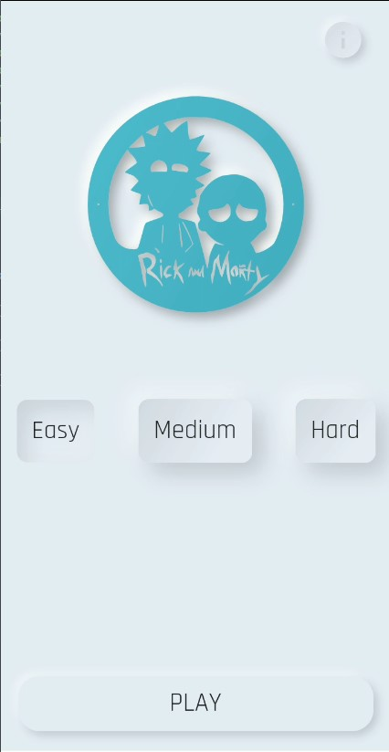
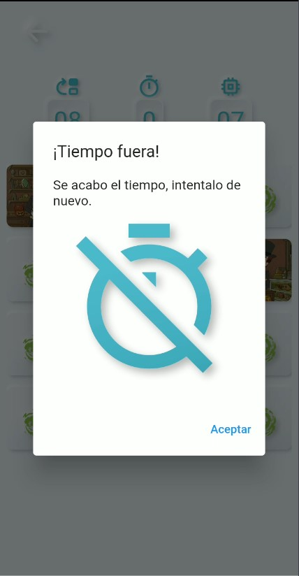

# Memory Game
[Descargar apk](https://drive.google.com/drive/folders/1jotiv6tGJV9WewO77EEPkNTB04KiEsWC?usp=sharing)
El proyecto fue realizado en flutter con ayuda de la api de [Rick & Morty](https://rickandmortyapi.com/)

  
  
   
  
  
   
  

> This is a challenge created by [MoureDev](https://www.twitch.tv/mouredev). He will review and give feedback to some
> proposed solutions from the community in one of his Twitch livestreams 😻 

**Surprise us! 😉**

## How it works?

The requirements for the game are pretty simple. First, you have to choose whatever theme you want to, like
Pokémon, Star Wars or even Peppa Pig!

The dynamics of the game will consist of presenting a board with a series of face-down cards and revealing all the pairs
before the time is up. The user will tap on each card to turn it over and, if two of them match when they are uncovered,
they will be turned face up. If not, they will be hidden again.

**The game is won if all pairs are uncovered within the time limit.**

So, the game will have an initial screen to select one of the three difficulties and 1 minute to solve each board:

* Easy: 4x4 board
* Medium: 4x6 board (or 6x4 depending on the screen)
* Difficult: 5x6 board (or 6x5 depending on screen)

The application will have a main game screen that contains the following elements:

* Game board. The board where the user will play and see the cards.
* Move counter. Every time 2 cards are turned over it will increase by 1, whether you hit or not.
* Time counter. A 1-min countdown to reveal all pairs!
* Remaining pairs counter.
* A button to return to the level selection screen.

## Technical requirements

* Create a **clean**, **maintainable** and **well-designed** code. We expect to see a good and clear architecture that
  allows to add or modify the solution without so much troubles.
* **Test** your code until you are comfortable with it. We don't expect a 100% of Code Coverage but some tests that
  helps to have a more stable and confident base code.

To understand how you take decisions during the implementation, **please write a COMMENTS.md** file explaining some of
the most important parts of the application. You would also be able to defend your code through
[Rviewer](https://rviewer.io), once you submit your solution.

---
